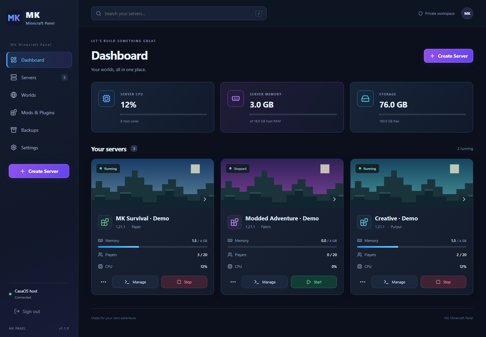
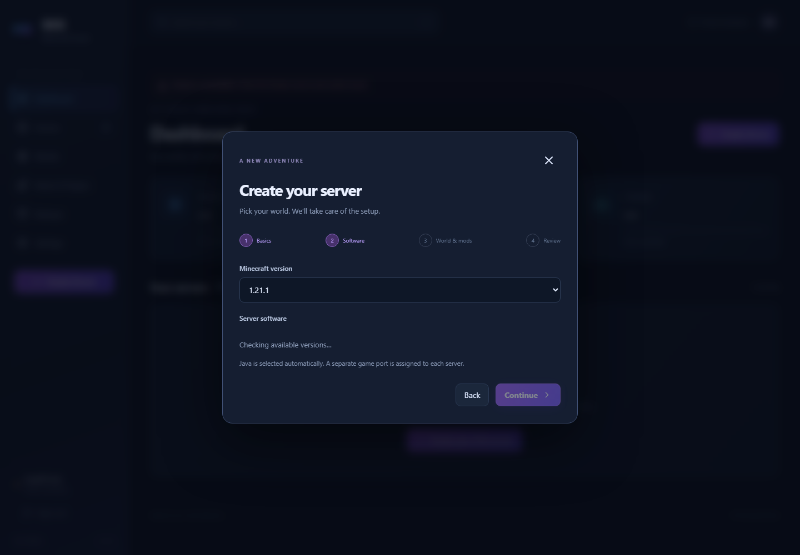
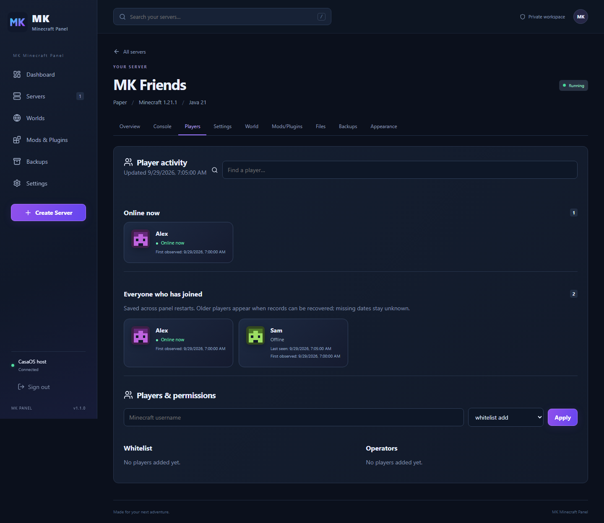
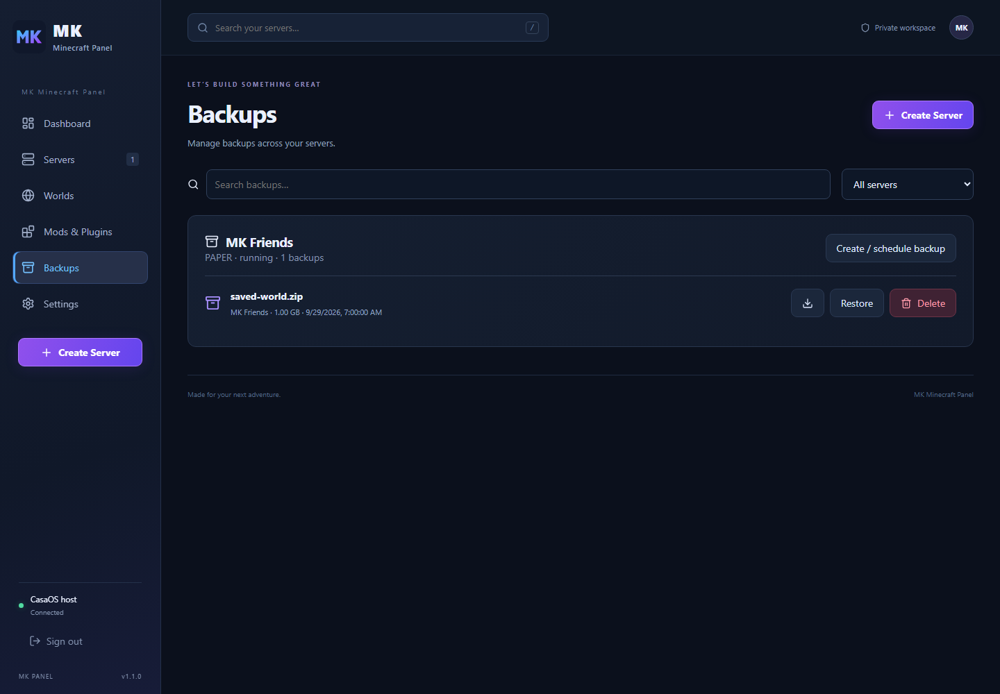

# MK Minecraft Panel

Your worlds. Your rules. A self-hosted Minecraft **Java** server manager for CasaOS on an Intel/AMD Debian machine.



Dashboard example uses clearly labeled demo servers; actual installations display live measurements.

Create independent Vanilla, Paper, Spigot, Purpur, Fabric, Forge, NeoForge, and Quilt servers, upload worlds, discover version-filtered Modrinth mods, back up worlds, and customize each server's banner, icon, and colored message.

## Installation on CasaOS

1. Check that your Debian laptop uses **x86_64 / amd64**: in its terminal, run `uname -m`. ARM packaging is not included in v1.
2. Download **[docker-compose.yml](https://github.com/MKonline08/mk-minecraft-panel/releases/latest/download/docker-compose.yml)** from the latest release.
3. In CasaOS, open **App Store → Custom Install → Import**, then import that file. CasaOS labels vary slightly by version. Leave storage and port defaults unchanged, then install.
4. Open **MK Minecraft Panel**, or visit `http://YOUR-LAPTOP-IP:8088`.
5. Create an administrator username and a password of at least 12 characters. Keep this first setup on your trusted LAN.
6. Click **Create Server**, choose its software and Minecraft version, allocate memory, optionally select a world ZIP and Modrinth project, and accept the Minecraft EULA. MK downloads everything and shows progress.



The screenshots show the real panel in a development browser; they do not depict the CasaOS install dialog or claim a test on your laptop.

Minimum practical starting point: a 64-bit Intel/AMD laptop, working Docker/CasaOS, 4 GB RAM for a small vanilla server, and several GB free storage. Larger mod packs need considerably more. Assigned Java memory has an additional 768 MB container allowance; leave RAM for Debian, CasaOS, and other apps. Initial downloads and world generation can take several minutes. The green Running badge requires the container's Minecraft health check to pass.

## Features and behavior

- One isolated Docker container, game port, and data folder per server. Only the game port is published; RCON stays inside the Minecraft container.
- Lifecycle controls, real CPU/memory values, live console, player/whitelist/operator commands, gameplay settings, and a text configuration editor.
- World ZIP import (2 GB upload, 8 GB expanded limit) validates paths and structure, stops Minecraft, backs up the existing server, and replaces its world. Java worlds only; Bedrock conversion is not provided.
- Manual and scheduled full-server backups with retention. Backups stop the server for consistency and restart it if it was running. Restores make a safety backup and leave the server stopped for review.
- Modrinth project search and required dependencies, version/loader filtering, checksum verification, and client requirements. Upload JAR files with a compatibility review; enable or disable installed files while stopped.
- Banner uploads automatically crop to 3:1; Minecraft icons convert to 64×64 PNG. Two-line MOTDs support Minecraft `§` formatting and preview colors. Restart to apply Minecraft MOTD/icon changes.
- First-run password setup, scrypt password hashing, HTTP-only sessions, origin/request protection, login rate limiting, and server-specific Docker ownership checks.
- Player cards separate **Online now** from **Everyone who has joined**, with search and saved history. Background tracking polls every five seconds, recovers available player files and logs, and uses UUIDs when known. Username-cache entries alone are not treated as evidence of joining. Historical dates may be unknown, and log formats modified by plugins may not be recognized. Pixel avatars are generated locally, not downloaded player skins.
- Workspace Worlds, Mods & Plugins, and Backups list their actual contents across servers, with search and server filters. Backups support individually confirmed deletion.
- Server overview includes RAM in use, configured Java RAM, server-file size and separate backup storage. Folder measurements refresh every 60 seconds or after panel file operations; symbolic links are excluded.
- Workspace Settings saves workspace name, display refresh frequency, administrator credentials and defaults for future servers. Account changes require the current password and sign other sessions out.
- Delete server is available in Overview, Settings and the server-card options menu. Exact-name confirmation starts a tracked job that stops the server, then permanently removes its container, world, mods, images, backups and player history. Download backups you want to retain first. The deletion job itself remains as an activity record.





**Compatibility labels describe metadata, not a runtime guarantee.** Unknown JAR metadata is shown as Unknown. Forge/NeoForge ranges, loader-specific behavior and arbitrary mod interactions cannot all be validated before startup. Test unfamiliar mod combinations on a separate server and keep backups. Players may need matching mods in their Minecraft clients. Vanilla does not load plugins; Paper/Spigot/Purpur load plugins, while Fabric/Forge/NeoForge/Quilt load mods.

v1 intentionally excludes timed MOTD rotation, CurseForge integration, full modpack import, public administration hosting, multiple admin roles, and automatic Minecraft version upgrades. To change a server's Minecraft version or loader, create a new instance and import a backup of its world only when compatible. Existing Modrinth-managed projects are not silently overwritten by an update.

## Storage, updates, and recovery

All persistent panel data lives at `/DATA/AppData/mk-minecraft-panel` on Debian:

```text
panel.sqlite         accounts, servers, jobs, schedules, player history, workspace settings
servers/<id>/        each Minecraft server's files
backups/<id>/        complete ZIP backups
images/<id>/         dashboard banners and icons
uploads/             queued world archives
staging/             temporary extraction and interrupted-operation recovery
```

Keep `HOST_DATA_DIR` equal to the **host** path mounted as `/data`; sibling Minecraft containers need that path. Do not mount a named volume in its place. To move storage, stop all Minecraft containers and the panel, copy the complete folder to the new location, and update both the mount source and `HOST_DATA_DIR`.

Before updating, stop your Minecraft servers, stop the panel, and copy the whole data folder to external storage. Change only the panel image version in CasaOS to `ghcr.io/mkonline08/mk-minecraft-panel:1.1.0` and apply the update. Keep your existing host port (including 8089 if you changed it) and data mount; importing a fresh Compose file may restore the default port 8088. Version 1.1 adds SQLite player-history tables automatically and preserves existing accounts and server settings. Server images are pinned to an itzg release and do not silently change with panel restarts.

If an existing server cannot start due to a RAM warning, open that server's **Settings**, lower **Server memory**, save, and start it again. The stopped Docker container is recreated with the new heap size. Its world, mods, and settings remain in the persistent data folder.

Jobs are persisted in SQLite. Start/stop/restart and explicitly confirmed deletion jobs resume after a panel restart. Other interrupted file-changing operations are marked failed for review; inspect preserved safety backups and any `staging/*-previous-*` folder before retrying. Failed server deletion can be retried from the same server after resolving the reported error; a failed stop does not delete files. A failed backup may leave Minecraft stopped: inspect the job and restart it after fixing the cause. Backups contain server configuration and should be kept private. Automatic retention also applies to safety backups; copy any backup you need to keep indefinitely elsewhere.

If you lose the administrator password, stop the panel and keep a copy of `panel.sqlite`; use SQLite to delete the `password` and `username` rows from `settings` and clear `sessions`, then restart and claim setup on your trusted LAN. Do not delete the database: it contains your server registrations.

## Connecting friends

On the same network, use the laptop's LAN address and the game port displayed by MK (first server normally `25565`, then the next free port). The laptop should have a stable DHCP reservation and should not sleep while hosting.

For friends outside your home, forward **only each intended Minecraft TCP game port** from your router to the laptop. Do **not** forward port 8088, Docker, or RCON. If your ISP uses carrier-grade NAT, normal port forwarding will not work; a private VPN or game tunnel is a separate setup. Online authentication remains enabled.

The panel manages Docker through its socket, which is powerful host-level access. Use only trusted admins, mods, and plugins, and keep the web UI on a trusted LAN or private VPN. CasaOS login does not replace the panel's own login. For a TLS reverse proxy, set `SECURE_COOKIE=true`; do not enable it for plain HTTP LAN access.

## Development and verification

Requires Node.js 24 and npm. For live Minecraft integration tests, use Linux with Docker running.

```sh
npm ci
npm run dev
npm run build
npm test
npx playwright install chromium
npm run test:e2e
SERVER_TYPE=VANILLA npm run test:smoke
```

API routes under `/api` require a session except health, login, setup, and auth status. Mutations require the `X-MK-Request: 1` header. Server operations return a persisted job; clients poll `/api/jobs`. `/api/servers`, `/api/catalog`, and `/api/system` supply the dashboard and wizard. Server-specific routes cover actions, logs, commands, players, settings, files, worlds, mods, images, and backups. The backend validates all inputs; browser controls are not security boundaries.

Version 1.1 adds `GET/PUT /api/workspace/settings`, `PUT /api/account`, `GET /api/workspace/content?kind=worlds|mods|backups`, and `GET /api/servers/:id/storage`. Players now returns structured `online` and `history` arrays plus `status` and `updatedAt`; whitelist/operator fields and actions remain. `DELETE /api/servers/:id` and `DELETE /api/servers/:id/backup/:name` return persisted jobs rather than immediate deletion results.

CI runs the production build, dependency audit, unit/API tests, desktop/mobile browser tests, and real Minecraft startup tests for all eight offered types at **1.21.1**. Vanilla, Paper, and Fabric also exercise concurrent servers and backup restoration. Successful tagged builds publish the image and Compose release. The version catalog checks upstream availability; it does not imply every historical version/mod combination was tested.

Check [Actions](https://github.com/MKonline08/mk-minecraft-panel/actions) for exact verification results. A passing Linux Docker workflow is not a substitute for testing on your own Debian/CasaOS installation.

## Upstream projects

- [Minecraft server container](https://github.com/itzg/docker-minecraft-server) and [Java image documentation](https://docker-minecraft-server.readthedocs.io/en/latest/versions/java/)
- [Modrinth API](https://docs.modrinth.com/)
- [CasaOS app packaging](https://github.com/IceWhaleTech/CasaOS-AppStore)

Not an official Minecraft product. Not approved by or associated with Mojang or Microsoft.
